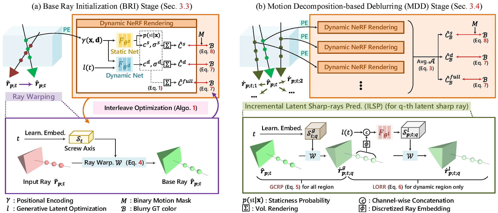

<div align="center">
<h2>DyBluRF: Dynamic Deblurring Neural Radiance Fields for Blurry Monocular Video</h2>

<div>    
    <a href='https://www.viclab.kaist.ac.kr/' target='_blank'>Minh-Quan Viet Bui</a><sup>* 1</sup>&nbsp;
    <a href='https://www.viclab.kaist.ac.kr/' target='_blank'>Jongmin Park</a><sup>* 1</sup>&nbsp;
    <a href='https://sites.google.com/view/ozbro/' target='_blank'>Jihyong Oh</a><sup>† 2</sup>&nbsp;
    <a href='https://www.viclab.kaist.ac.kr/' target='_blank'>Munchurl Kim</a><sup>† 1</sup>
</div>
<div>
    <sup>*</sup>Co-first authors (equal contribution)</span>
</div>
<div>
    <sup>†</sup>Co-corresponding authors (equal advising)</span>
</div>
<div>
    <sup>1</sup>Korea Advanced Institute of Science and Technology, South Korea
</div>
<div>
    <sup>2</sup>Chung-Ang University, South Korea
</div>

<div>
    <h4 align="center">
        <a href="https://kaist-viclab.github.io/dyblurf-site/" target='_blank'>
        
        </a>
        <a href="https://arxiv.org/abs/2312.13528" target='_blank'>
        
        </a>
        <a href="https://www.youtube.com/watch?v=jJeUCPWlsDA&ab_channel=VICLabKAIST" target='_blank'>
        
        </a>
        <a href="" target='_blank'>
        
        </a>
        
    </h4>
</div>

---

<div align="center">
    <h4>
        This repository is the official PyTorch implementation of "DyBluRF: Dynamic Deblurring Neural Radiance Fields for Blurry Monocular Video". DyBluRF achieves state-of-the-art performance in novel problem setting of dynamic deblurring NeRF.
    </h4>
</div>


<div style="width: 100%; text-align: center; margin:auto;">
    
</div>

<div align="center">
    <h4>
        Please visit our <a href="https://kaist-viclab.github.io/dyblurf-site/" target='_blank'>project page</a> for more visual results.
    </h4>
</div>

</div>

## 🎬 Network Architecture


<h4>
    Codes and pretrained models will be updated soon.
</h4>

---

#### News
- **March 26, 2024:** This repository is created
- **December 21, 2023:** This paper is uploaded to Arxiv

---
<!-- **Reference**:   -->
## Reference
```BibTeX
@article{bui2023dyblurf,
      title={DyBluRF: Dynamic Deblurring Neural Radiance Fields for Blurry Monocular Video}, 
      author={Minh-Quan Viet Bui and Jongmin Park and Jihyong Oh and Munchurl Kim},
      journal={arXiv preprint arXiv:2312.13528},
      year={2023}
```
---
